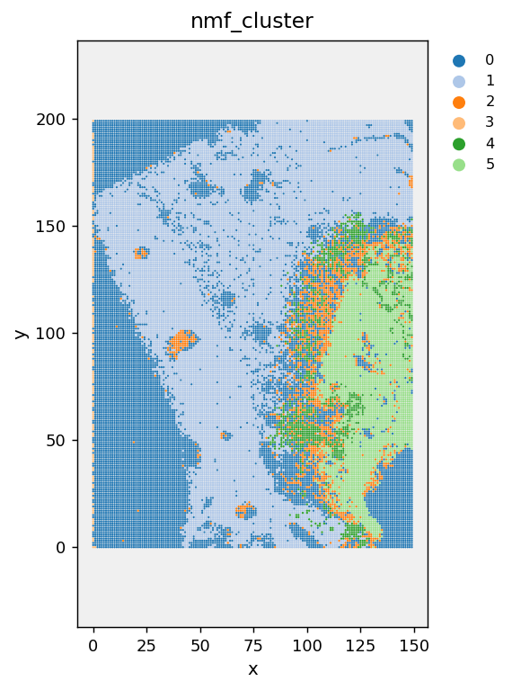
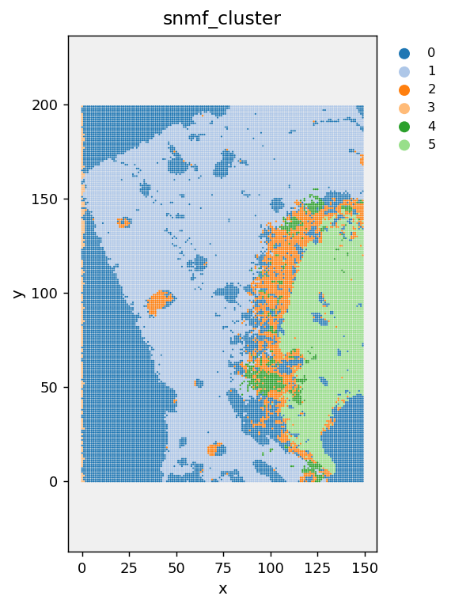

# Analysis. Clustering

## `cluster`

```python
mt.cluster(
    adata, resolution: float | list[float] = 0.5, key_added: str = "cluster",
    random_state: int = 0, copy: bool = False,
) -> anndata.AnnData
```

Leiden community detection on the kNN graph, purely in **chemistry
space** (two physically distant pixels with similar chemistry land in
the same cluster). For spatially-contiguous regions instead, see
[`spatial_domains()`](#spatial_domains).

| Parameter | Default | Description |
|---|---|---|
| `resolution` | `0.5` | Higher = more, smaller clusters. Typical range 0.1-2.0. Pass a **list** (e.g. `[0.1, 0.3, 0.5]`) to sweep multiple resolutions in one call, saved as `cluster_0.1`, `cluster_0.3`, etc. |
| `key_added` | `"cluster"` | Column name in `adata.obs` |

**Raises:** [`NoEmbeddingError`](exceptions.md#noembeddingerror) if no
kNN graph exists; [`InvalidParameterError`](exceptions.md#invalidparametererror)
if `resolution <= 0`.

```python
adata = mt.cluster(adata, resolution=0.5)
adata = mt.cluster(adata, resolution=[0.1, 0.3, 0.5, 1.0])  # resolution sweep
```

!!! tip "Which resolution should I use?"
    Run a sweep, then compare clusterings objectively instead of
    eyeballing it, see [`cluster_validation()`](analysis-validation.md#cluster_validation)
    (silhouette score) and [`compare_clusterings()`](analysis-validation.md#compare_clusterings)
    (ARI/AMI between two resolutions, to check stability).

---

## `spatial_domains`

```python
mt.spatial_domains(
    adata, resolution: float = 0.5, alpha: float = 0.5, n_neighbors: int = 6,
    batch_key: str = "sample", key_added: str = "domain",
    random_state: int = 0, copy: bool = False,
) -> anndata.AnnData
```

Spatially-aware clustering ("niche"/tissue-domain detection): smooths
each pixel's PCA embedding towards its **physical** neighbours before
running Leiden, so results tend toward contiguous anatomical regions
rather than scattered chemical clusters.

| Parameter | Default | Description |
|---|---|---|
| `alpha` | `0.5` | Spatial smoothing strength, `[0, 1]`. `0` = identical to `cluster()` (no smoothing). `1` = each pixel replaced entirely by its physical neighbours' mean. |
| `n_neighbors` | `6` | Physical neighbours used for smoothing |
| `batch_key` | `"sample"` | Prevents smoothing across independent samples |

**Raises:** [`NoEmbeddingError`](exceptions.md#noembeddingerror);
[`InvalidParameterError`](exceptions.md#invalidparametererror) if
`alpha` outside `[0, 1]` or `resolution <= 0`.

```python
adata = mt.spatial_domains(adata, resolution=0.5, alpha=0.5)
mt.plot_spatial(adata, color="domain")
```

<div class="mortis-img-grid" markdown>
<figure markdown>
  
  <figcaption><code>cluster()</code>, chemistry space only</figcaption>
</figure>
<figure markdown>
  
  <figcaption><code>spatial_domains()</code>, same sample, alpha=0.6: visibly more spatially contiguous</figcaption>
</figure>
</div>

!!! note "Honest example, not a cherry-picked one"
    Note the domain map above still has speckle at the tissue edges,
    increasing `alpha` (stronger smoothing) or `n_neighbors` trades some
    of that residual noise for coarser domain boundaries. There's no
    universally "correct" `alpha`; pick based on whether you care more
    about capturing fine sub-structure or clean contiguous regions.

## `spatial_domains_kmeans`

```python
mt.spatial_domains_kmeans(
    adata, n_domains: int = 8, alpha: float = 0.5, n_neighbors: int = 6,
    batch_key: str = "sample", key_added: str = "domain_kmeans",
    random_state: int = 0, copy: bool = False,
) -> anndata.AnnData
```

Fast, fixed-`k` alternative to [`spatial_domains()`](#spatial_domains):
same physical-neighbour smoothing, but k-means instead of Leiden.
Faster on very large images, and you specify the exact domain count
directly instead of indirectly tuning `resolution`.

**Raises:** [`NoEmbeddingError`](exceptions.md#noembeddingerror);
[`InvalidParameterError`](exceptions.md#invalidparametererror) if `n_domains < 2`.

```python
adata = mt.spatial_domains_kmeans(adata, n_domains=8, alpha=0.5)
```

---

## `cluster_nmf`

```python
mt.cluster_nmf(
    adata, n_components: int = 10, key_added: str = "nmf_cluster",
    basis_key: str = "X_nmf", use_hardware: bool = True,
    random_state: int = 0, copy: bool = False,
) -> tuple[anndata.AnnData, pandas.DataFrame]
```

Non-negative Matrix Factorization, **soft**, parts-based clustering,
useful when tissue regions blend rather than have hard boundaries (a
pixel can partially belong to multiple metabolic programs).

**Returns:** `(AnnData, DataFrame)`, `adata.obsm[basis_key]` (per-pixel
component weights), `adata.obs[key_added]` (argmax hard assignment for
convenience), and a tidy DataFrame of the top-weighted metabolites per
component.

**Raises:** [`InvalidParameterError`](exceptions.md#invalidparametererror)
if `n_components < 2`.

```python
adata, nmf_df = mt.cluster_nmf(adata, n_components=8)
mt.plot_spatial(adata, color="nmf_cluster")
```

<div class="mortis-figure" markdown>

<figcaption>8-component NMF on a 30,000-pixel sample</figcaption>
</div>

## `spatially_weighted_nmf`

```python
mt.spatially_weighted_nmf(
    adata, n_components: int = 10, alpha: float = 0.5, n_neighbors: int = 6,
    batch_key: str = "sample", use_hardware: bool = True,
    random_state: int = 0, copy: bool = False,
) -> tuple[anndata.AnnData, pandas.DataFrame]
```

NMF run on a spatially-smoothed version of the data (blends each pixel
with its physical neighbours before factorization), extracts spatial
"microenvironments" rather than purely chemical components.

```python
adata, snmf_df = mt.spatially_weighted_nmf(adata, n_components=6, alpha=0.5)
mt.plot_spatial(adata, color="snmf_cluster")
```

<div class="mortis-figure" markdown>

<figcaption>Same sample, spatially-smoothed before factorization, compare boundary smoothness to the plain NMF map above</figcaption>
</div>

---

## `rename_clusters`

```python
mt.rename_clusters(adata, mapping: dict[str, str], cluster_key: str = "cluster") -> anndata.AnnData
```

Rename cluster IDs to biologically meaningful labels. Original IDs are
preserved in `adata.obs[cluster_key + "_original"]` so nothing is lost.

**Raises:** [`NoClustersError`](exceptions.md#noclusterserror).

```python
mt.rename_clusters(adata, mapping={
    "0": "Tumour core",
    "1": "Stroma",
    "2": "Necrosis",
})
```

