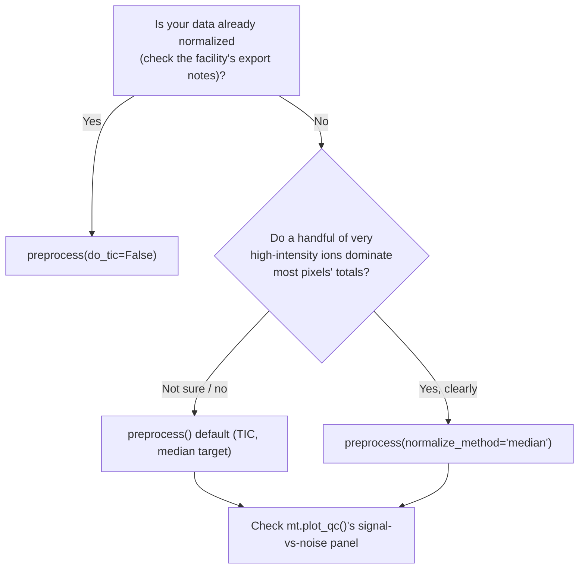

# Choosing a Normalization Method

<span class="mortis-badge developer">Background + decision guide</span>

Every MSI pixel's total ion signal depends partly on real chemistry and
partly on things that have nothing to do with biology: how well the
matrix crystallized at that spot, local ionization efficiency, laser
power drift, etc. Normalization tries to remove the second kind of
variation while keeping the first. There is no universally "correct"
choice, but some options are measurably more robust than others.

| Method | Function | When to use |
|---|---|---|
| TIC (median target) | `mt.tic_normalize()` / `mt.preprocess()` (default) | General-purpose default. Assumes total ion signal is roughly comparable across pixels. |
| Median-intensity | `mt.median_normalize()` / `mt.preprocess(normalize_method="median")` | More robust when a handful of high-intensity ions (e.g. abundant membrane lipids) dominate the pixel total. Multiple metabolomics normalization benchmarks (Wulff et al. 2018; De Graeve et al. 2023) found median-based normalization outperforms TIC. |
| No normalization | `mt.preprocess(do_tic=False)` | Your data is already normalized upstream; some facility exports are pre-TIC-normalized. **Check this before re-normalizing**, since normalizing twice will distort your intensities. |

## Why TIC isn't the automatic right answer

Total Ion Current (TIC) normalization scales every pixel so its **total**
intensity matches a common target. The implicit assumption: *the total
amount of ionizable material is roughly the same everywhere.* That
assumption is often wrong in tissue:

- If one tissue region is genuinely more metabolically active than
  another, TIC normalization can partially **erase** that real
  biological difference (Cairns et al. 2007), the exact signal you may
  be trying to detect.
- A handful of very abundant lipid species can dominate a pixel's total,
  so TIC normalization is effectively normalizing by those few species,
  not by "everything."

## MORTIS's TIC default targets the median, not 1.0

If you've used TIC normalization elsewhere, you may expect it to scale
every pixel's total to exactly `1.0` (a proportion). MORTIS's default
target is the **median row sum across all pixels** instead:

```python
adata = mt.tic_normalize(adata)               # scales to the median total (default)
adata = mt.tic_normalize(adata, target_sum=1.0)  # classic "proportion" TIC, if you want it
```

This is deliberate: scaling to `1.0` compresses every value into a tiny
range, and the next pipeline step (`log1p`) becomes almost a no-op on
numbers that small, so you lose the variance-stabilizing benefit of the
log transform. Targeting the median keeps values at a scale where
`log1p` still does something useful.

## A practical decision path



Whichever you choose, sanity-check it: if you're comparing two
conditions, make sure the normalization didn't erase the very
difference you're testing for (e.g. plot a few known marker metabolites
before/after normalization and confirm the direction of the biological
effect is preserved).

## Ion suppression is spatially heterogeneous

Ion suppression (signal loss due to co-eluting/co-crystallizing
compounds) is not uniform across a tissue section. It depends on local
composition. This means *any* single global scale factor per pixel is
an approximation, no matter which method you pick. There is currently
no discrete "ion suppression correction" algorithm in MORTIS beyond
choosing a good normalization strategy. This is an open area where the
best practical mitigation is still normalization-strategy choice plus
visual QC, not a single corrective algorithm.

## See also

- [`mt.tic_normalize()`](../api/preprocessing.md#tic_normalize) / [`mt.median_normalize()`](../api/preprocessing.md#median_normalize), full parameter reference.
- [`mt.plot_qc()`](../api/plotting.md#plot_qc): visualize the effect of your filtering/normalization choices.
- [Batch Correction](batch-correction.md): a related but distinct problem (removing *sample-to-sample* technical variation, not *pixel-to-pixel*).

