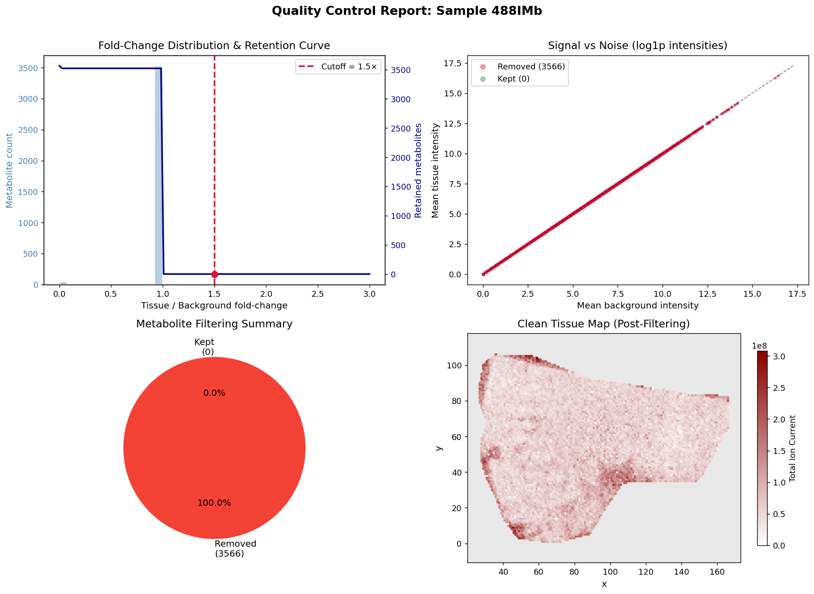
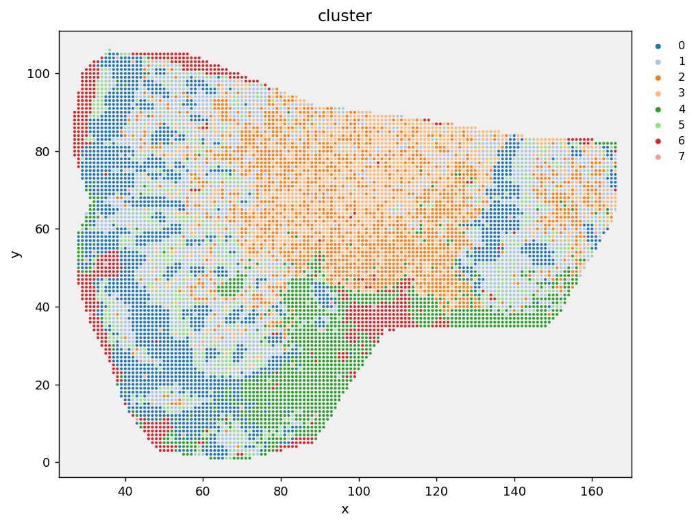
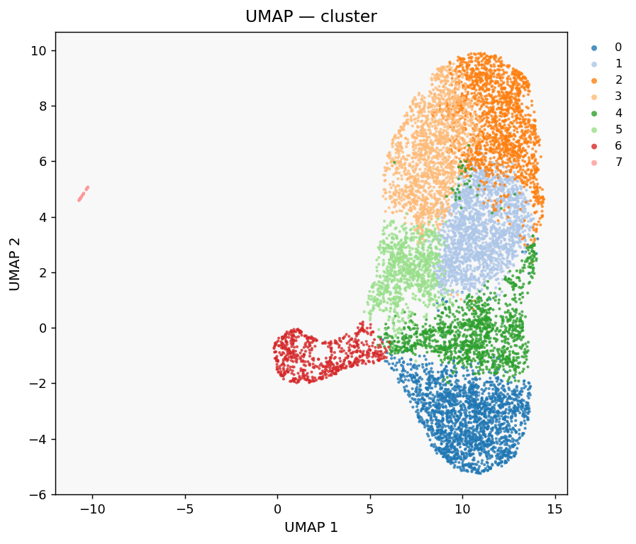
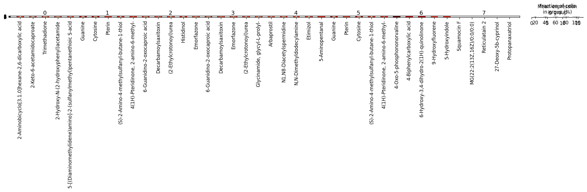
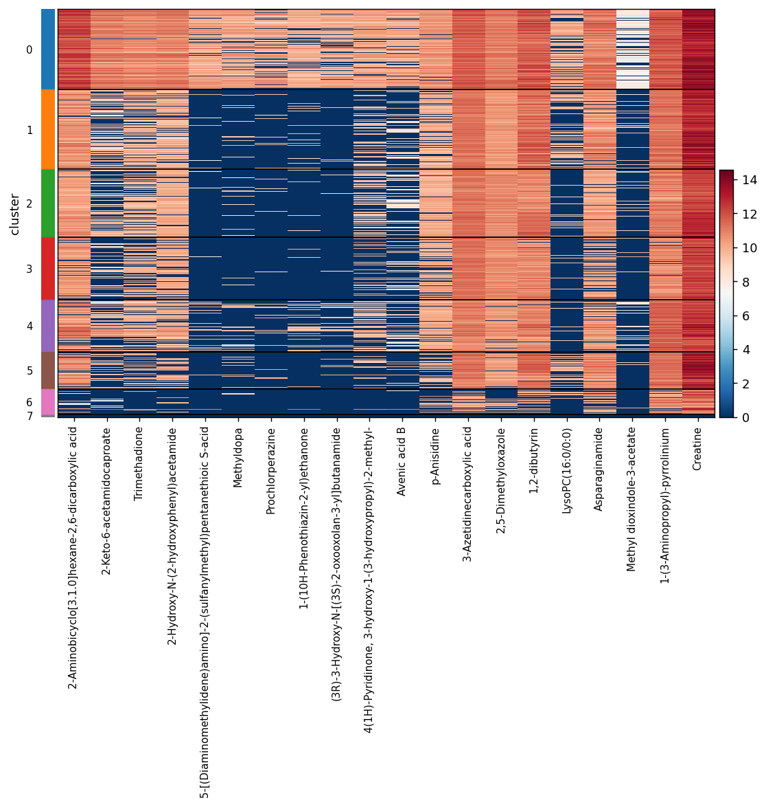
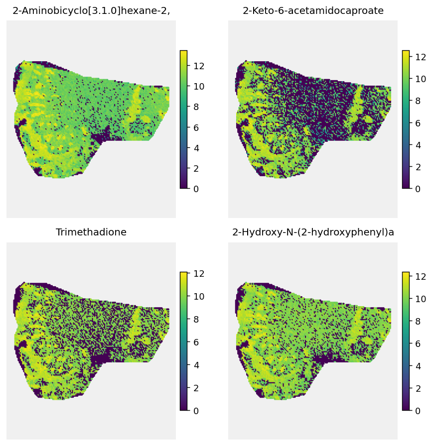

# Tutorial 1: QC & Annotation Scoring

<span class="mortis-badge beginner">Follow along even if this is your first MORTIS analysis</span>

**Data:** a paired tissue/background export, one `.xlsx` file for the
tissue region, one for the background region, both from the same
acquisition. This is one of the most common facility export formats.

## Loading and pairing

```python
import mortis as mt

adata_t = mt.read_metabolomics_data("488IMb_tissue.xlsx")
adata_t.obs["is_tissue"] = True
adata_t.obs["is_background"] = False

adata_b = mt.read_metabolomics_data("488IMb_background.xlsx")
adata_b.obs["is_tissue"] = False
adata_b.obs["is_background"] = True
```

!!! tip "Usually you don't do this by hand"
    If your files are named `..._tissue.xlsx` / `..._background.xlsx`,
    `mt.load_from_folder("./data")` finds and pairs them automatically,
    setting `is_tissue`/`is_background` for you. We're doing it manually
    here just to show what's happening underneath.

## Background filtering, and a real QC failure

```python
merged = ad.concat([adata_t, adata_b], join="outer", fill_value=0.0)
clean, stats = mt.filter_background([merged], cutoff=1.5, mode="sample")
mt.plot_qc(stats[0], clean[0], sample_name="Sample 488IMb")
```

<div class="mortis-figure" markdown>

</div>

**Every single metabolite was removed.** Before assuming something's
wrong with MORTIS, look at what the report is actually showing: the
signal-vs-noise scatter (top right) shows every point sitting exactly
on the diagonal, mean tissue intensity **equals** mean background
intensity, for every metabolite. That's not "close to 1x fold change,"
it's **exactly** 1.0000 for every single metabolite, which is normal
biological/technical noise never producing.

We checked, and it turned out the two source files were **byte-for-byte
identical** (confirmed with a checksum), almost certainly a copy-paste
mistake when the export was prepared, not a MORTIS bug. This is worth
knowing because it's a realistic failure mode:

!!! warning "How to recognize this yourself"
    If `filter_background()` rejects everything, check
    `stats[0]['fold_change'].max()` before debugging the code. If it's
    suspiciously close to exactly `1.0`, compare your two source files
    directly (e.g. `md5sum tissue.xlsx background.xlsx` on macOS/Linux,
    `Get-FileHash` on Windows) before assuming anything else is wrong.

For the rest of this tutorial, we continue on the tissue file alone
(unfiltered by background) so we can still demonstrate the rest of the
pipeline on real data.

## Merging in a separate annotation-score table

This facility's export doesn't embed annotation confidence scores in
the tissue/background files, they're in a separate feature table:

```python
adata = adata_t.copy()
adata = mt.load_annotation_scores(adata, "feature_table.xlsx")
# [MORTIS] Annotation scores merged from 'feature_table.xlsx':
#   1288 / 3566 metabolites matched -> adata.var['score']
# [MORTIS] Warning: 2278 metabolite(s) had no match in the feature
#   table and will have NaN scores (filter_by_score drops these).

adata = mt.filter_by_score(adata, min_score=0.3)
# [MORTIS] Score filter (>=0.3): kept 706 / 3566 metabolites (2860 removed)
```

Only about a third of the metabolite columns in the raw export had a
confident annotation at all. This is completely normal for untargeted
MSI; a large fraction of detected ions are never matched to a database
compound with high confidence.

## Preprocess, embed, cluster

```python
adata = mt.preprocess(adata, n_pcs=30, n_neighbors=15)
adata = mt.run_umap(adata)
adata = mt.cluster(adata, resolution=0.5)
# [MORTIS] Leiden clustering: 8 clusters at resolution 0.5
```

<div class="mortis-img-grid" markdown>
<figure markdown><figcaption><code>mt.plot_spatial(adata, color="cluster")</code></figcaption></figure>
<figure markdown><figcaption><code>mt.plot_umap(adata, color="cluster")</code></figcaption></figure>
</div>

## Marker metabolites per cluster

```python
adata, markers = mt.find_markers(adata, n_top=20)
mt.plot_markers(adata, n_top=5)
mt.plot_heatmap(adata, markers["metabolite"].head(20).tolist(), groupby="cluster")
mt.plot_embedding_grid(adata, markers["metabolite"].head(4).tolist(), ncols=2)
```

<div class="mortis-img-grid" markdown>
<figure markdown><figcaption>Top 5 markers per cluster</figcaption></figure>
<figure markdown><figcaption>Top 20 markers, all clusters</figcaption></figure>
<figure markdown><figcaption>Top 4 markers as individual ion images</figcaption></figure>
</div>

## What would I change for my own data?

- If your tissue/background pair is genuinely different (the normal
  case), skip straight from loading to `filter_background()`, the
  identical-files issue here was specific to this example dataset.
- If your `.h5ad` already came from METASPACE/SCiLS, it likely already
  has `adata.var['score']` populated, skip `load_annotation_scores()`
  entirely and go straight to `filter_by_score()`.
- Try `min_score=0.5` or `0.8` if you want only high-confidence/library-match
  metabolites, at the cost of fewer metabolites surviving.

**Next:** [Tutorial 2. Single-Sample Deep Dive](02-single-sample-deep-dive.md)
(spatial statistics, hotspot detection, colocalization).

