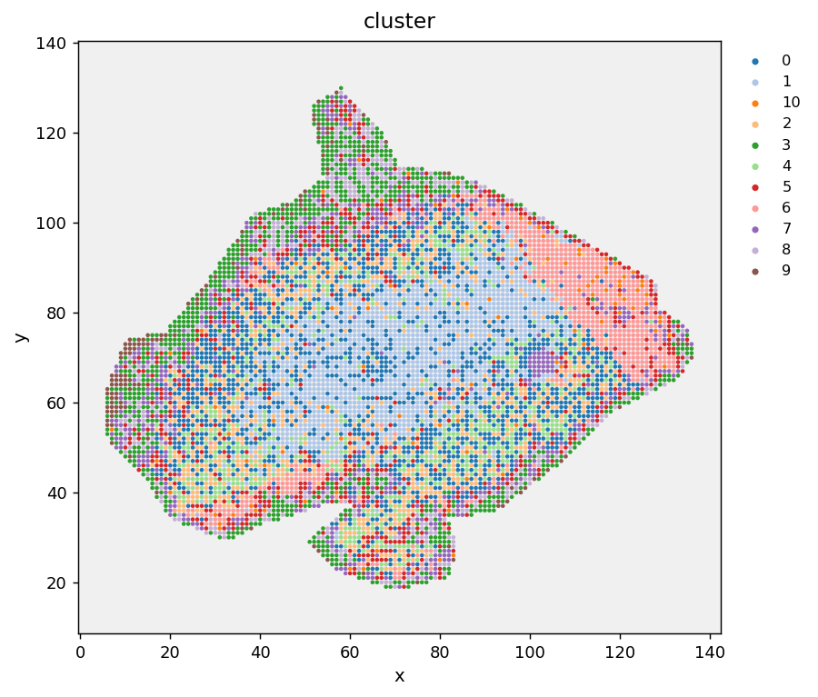
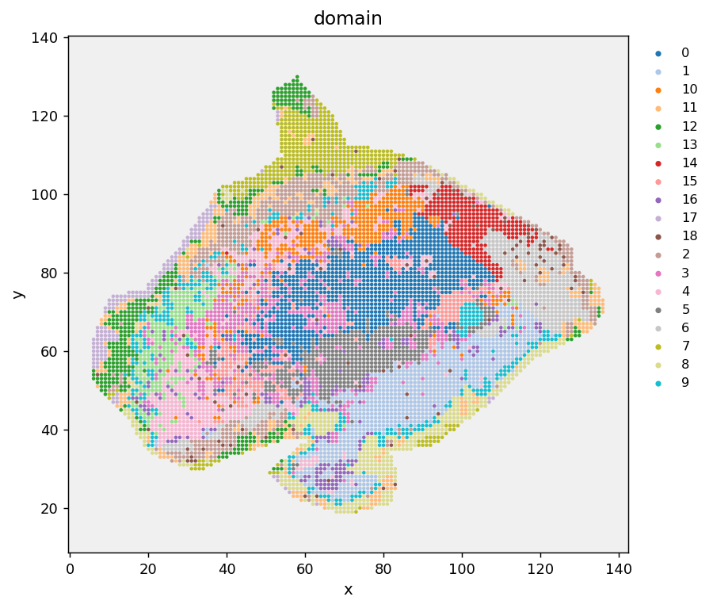
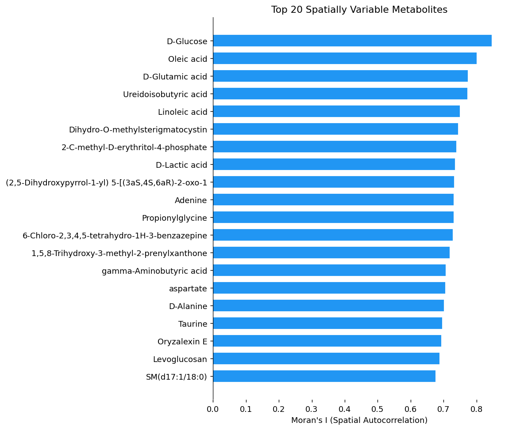
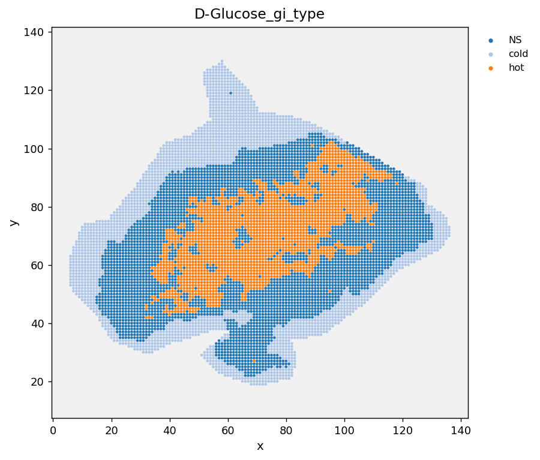
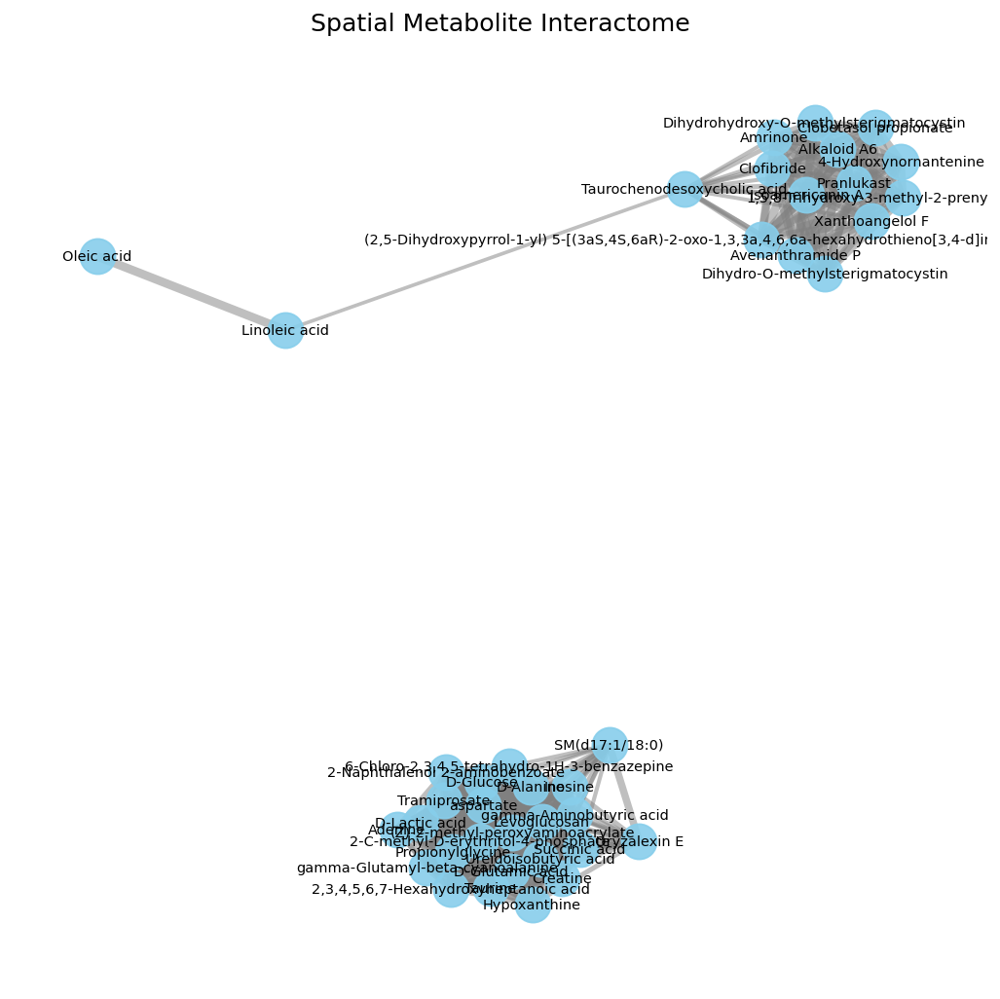
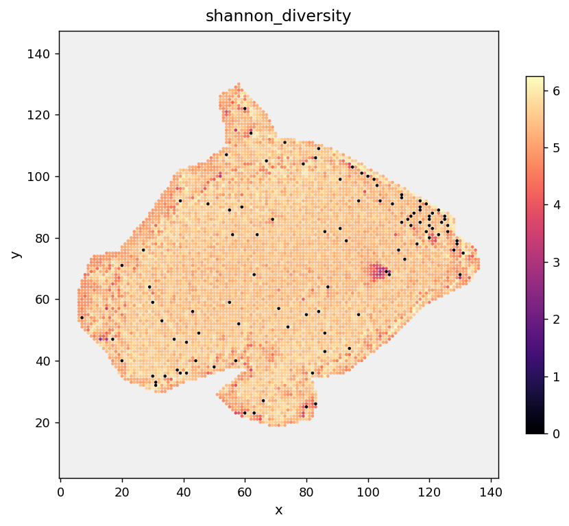

# Tutorial 2: Single-Sample Deep Dive

<span class="mortis-badge developer">Spatial statistics, hotspots, and colocalization on one real sample</span>

**Data:** a METASPACE-annotated `.h5ad` sample (already has
`adata.var['score']` populated, and `is_tissue`-style ROI flags built
in) — a healthy tissue section, ~8,000 tissue pixels x ~4,000 metabolites.

## Loading and score filtering

```python
import anndata as ad
import mortis as mt

adata = ad.read_h5ad("1b_P487_Healthy_sez1.h5ad")
adata = adata[adata.obs["Sample_roi"].values].copy()   # keep tissue-flagged pixels only
adata = mt.filter_by_score(adata, min_score=0.3)
# [MORTIS] Score filter (>=0.3): kept 2041 / 4023 metabolites
```

## Chemistry clustering vs. spatial domains

```python
adata = mt.preprocess(adata, n_pcs=30, n_neighbors=15)
adata = mt.run_umap(adata)
adata = mt.cluster(adata, resolution=0.6)
# [MORTIS] Leiden clustering: 11 clusters at resolution 0.6

adata = mt.spatial_domains(adata, resolution=0.6, alpha=0.6)
# [MORTIS] Spatial domains: 19 contiguous domain(s) found (alpha=0.6)
```

<div class="mortis-img-grid" markdown>
<figure markdown><figcaption><code>cluster()</code> — noticeably speckled; two physically distant pixels with similar chemistry land in the same cluster</figcaption></figure>
<figure markdown><figcaption><code>spatial_domains()</code>, same sample — visibly more spatially contiguous, though not perfectly clean</figcaption></figure>
</div>

!!! note "This is a real, honest comparison — not a cherry-picked one"
    Notice the spatial-domains map still has speckle at tissue edges.
    `alpha=0.6` is a moderate smoothing strength; increasing it (or
    `n_neighbors`) trades residual noise for coarser domain boundaries.
    There's no universally "correct" setting — try a few and look.

## Which metabolites are spatially organized at all?

```python
adata, morans = mt.spatial_autocorrelation(adata, n_neighbors=6)
# [MORTIS] Moran's I: 1537/2041 spatially variable (p<0.05, FDR=False)
mt.plot_morans(morans, n_top=20)
```

<div class="mortis-figure" markdown>

</div>

Over 75% of annotated metabolites show statistically significant
spatial structure in this sample — not unusual for real tissue, where
almost everything has *some* spatial organization; the interesting
question is usually *which* pattern, not *whether there's a pattern at
all*.

## Where exactly is the top metabolite's hotspot?

```python
top_met = morans.iloc[0]["metabolite"]   # "D-Glucose"
adata, gi_df = mt.getis_ord_gi(adata, top_met, n_neighbors=6)
# [MORTIS] Getis-Ord Gi* 'D-Glucose': hot=2060, cold=2290
mt.plot_spatial(adata, color=f"{top_met}_gi_type")
```

<div class="mortis-figure" markdown>

</div>

## Do clusters spatially co-localize more than chance?

```python
adata = mt.spatial_neighbors(adata, n_neighbors=6)
adata, enrich = mt.neighborhood_enrichment(adata, n_permutations=500)
print(enrich.sort_values("zscore", ascending=False).head(5))
```
```
   cluster_a cluster_b  observed     expected      zscore  pval
0          1         1      5842   857.60       202.6     0.0
1          6         6      2890   193.89       199.0     0.0
2          3         3      2736   310.29       155.7     0.0
```
The diagonal entries (cluster `X` next to cluster `X`) dominating the
top of this table is expected and healthy — it means each cluster is
internally spatially contiguous (real tissue regions), not scattered
noise pretending to be a cluster.

## A colocalization network across many metabolites

```python
edges = mt.metabolite_colocalization(adata, top_n=40, corr_threshold=0.4)
# [MORTIS] Metabolite Interactome (pearson): Found 359 high-confidence edges
mt.plot_colocalization_network(edges)
```

<div class="mortis-figure" markdown>

</div>

## Per-pixel chemical diversity

```python
adata = mt.diversity_index(adata, method="shannon")
mt.plot_spatial(adata, color="shannon_diversity", cmap="magma")
```

<div class="mortis-figure" markdown>

</div>

## What would I change for my own data?

- Try both `spatial_domains()` and `spatial_domains_kmeans()` — the
  latter lets you specify an exact number of domains instead of tuning
  `resolution`.
- If `getis_ord_gi`/`local_moran` disagree meaningfully on a
  metabolite, that's informative — it usually means the metabolite has
  real spatial *outliers*, not just clean hot/cold regions (see
  [Spatial Statistics Explained](../concepts/spatial-statistics.md)).
- `metabolite_colocalization(metric="cosine")` is worth trying if your
  ion images are sparse (mostly zero) with a clear on/off pattern —
  it's less sensitive to that than Pearson correlation.

**Next:** [Tutorial 3 — Large-Scale Microenvironments](03-large-scale-microenvironments.md)
(NMF at 30,000-pixel scale).
