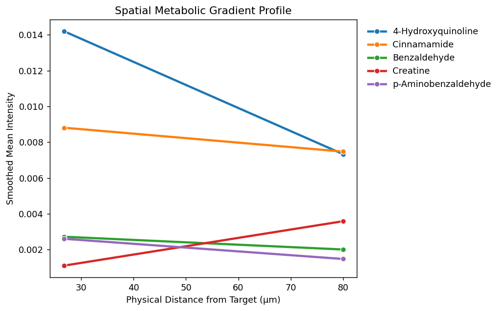
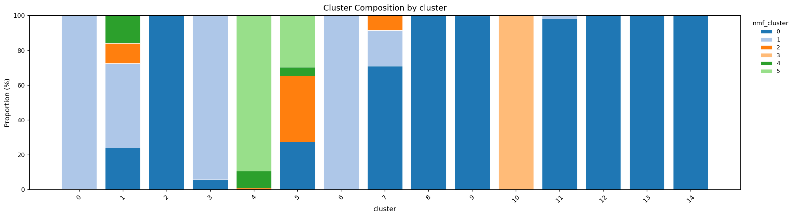

# Tutorial 3: Large-Scale Microenvironments

<span class="mortis-badge developer">NMF-based "microenvironments" at 30,000-pixel scale</span>

**Data:** a larger single sample (~30,000 pixels, ~2,000 metabolites) —
big enough to show how MORTIS behaves at scale, and to make the
difference between plain NMF and spatially-weighted NMF visually clear.

## Load, score-filter, preprocess, cluster

```python
import anndata as ad
import mortis as mt

adata = ad.read_h5ad("glass_1_left.h5ad")
adata = mt.filter_by_score(adata, min_score=0.3)
# [MORTIS] Score filter (>=0.3): kept 802 / 1952 metabolites

adata = mt.preprocess(adata, n_pcs=30, n_neighbors=15)
adata = mt.cluster(adata, resolution=0.4)
# [MORTIS] Leiden clustering: 15 clusters at resolution 0.4
```

## Chemical microenvironments (NMF)

Unlike hard clustering, NMF gives **soft**, parts-based assignments —
useful when tissue regions blend into each other rather than having
sharp boundaries.

```python
adata, nmf_df = mt.cluster_nmf(adata, n_components=6)
mt.plot_spatial(adata, color="nmf_cluster")
```

<div class="mortis-figure" markdown>

</div>

## Spatially-weighted NMF

Same idea, but the data is smoothed across each pixel's physical
neighbours *before* factorization — extracting spatial
"microenvironments" rather than purely chemical ones.

```python
adata, snmf_df = mt.spatially_weighted_nmf(adata, n_components=6, alpha=0.5)
mt.plot_spatial(adata, color="snmf_cluster")
```

<div class="mortis-figure" markdown>

</div>

Compare the two maps above: the spatially-weighted version has visibly
smoother, more contiguous component boundaries — the same effect as
`spatial_domains()` vs. `cluster()`, applied to a soft/NMF clustering
instead of a hard Leiden one.

## Spatial gradient from a reference region

How does metabolite intensity change as you move away from cluster `"0"`?

```python
grad_df = mt.spatial_gradient(adata, target_col="cluster", target_val="0",
                               bins=15, max_dist=800.0)
mt.plot_spatial_gradient(grad_df, top_n=5)
```

<div class="mortis-figure" markdown>

</div>

## Cluster composition

```python
mt.plot_cluster_composition(adata, cluster_key="nmf_cluster", groupby="cluster")
```

<div class="mortis-figure" markdown>

</div>

This cross-tabulates the NMF microenvironments against the Leiden
clusters — a quick way to see whether the two clustering approaches
agree, partially agree, or capture genuinely different structure. If
you want a formal number instead of eyeballing a bar chart, see
[`compare_clusterings()`](../api/analysis-validation.md#compare_clusterings)
(ARI/AMI).

## What would I change for my own data?

- On datasets this size, the *first* call to `run_neighbors`/`run_umap`
  in your Python session pays a one-time ~15s Numba compilation cost —
  see [Performance & Threading](../concepts/performance.md) before you
  conclude something is slow/broken.
- Try a few different `n_components` for NMF (e.g. 4, 6, 10) — there's
  no automatic "correct" number; look at whether components correspond
  to visually/biologically distinct regions.
- `use_hardware=True` (the default on `cluster_nmf`/`spatially_weighted_nmf`/
  `run_pca`/`run_umap`/`run_harmony`) transparently uses a GPU (via
  `cuml`/CUDA) if one is available — irrelevant on a Mac like the one
  used to generate this tutorial, but worth knowing on a CUDA machine
  with much larger datasets.

**Next:** [Tutorial 4 — Cohort Comparison](04-cohort-comparison.md) (merging
14 samples, differential expression, and verifying batch correction).
