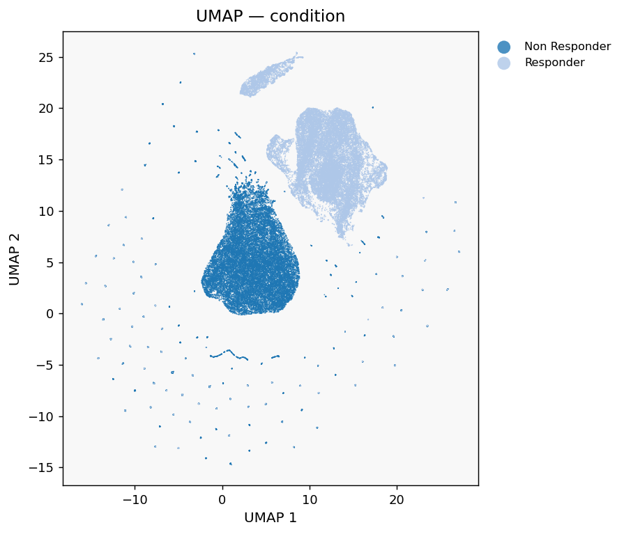
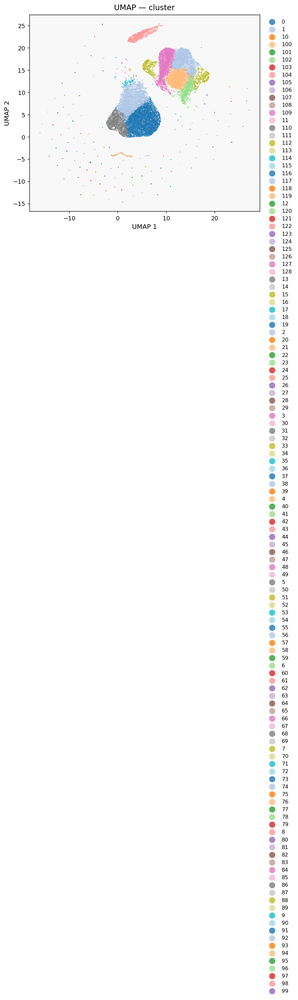
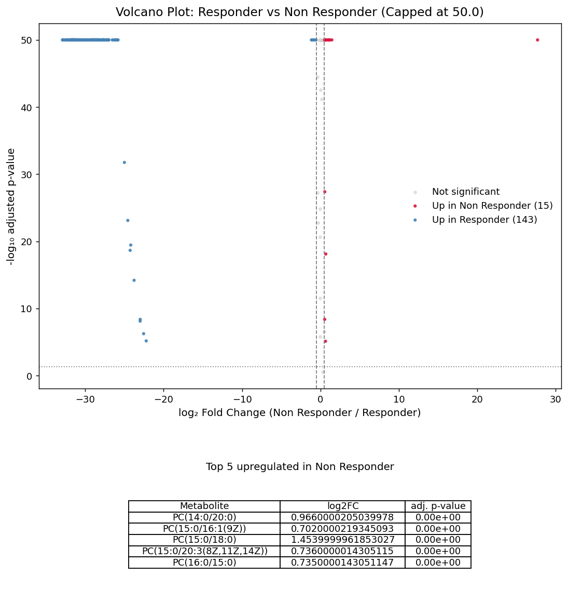
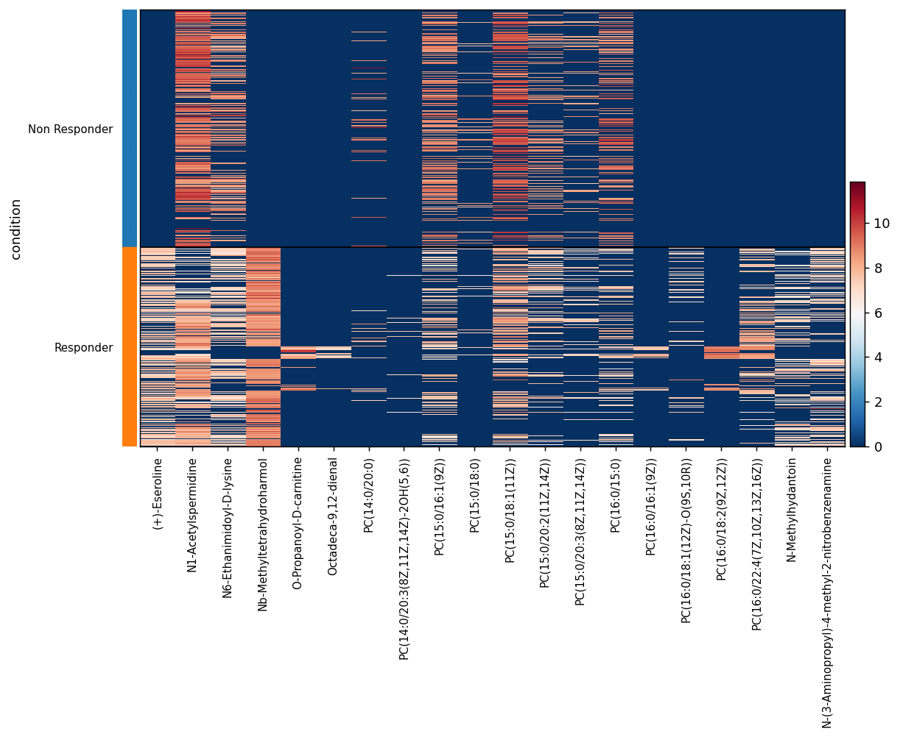
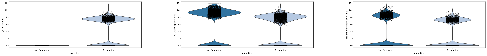
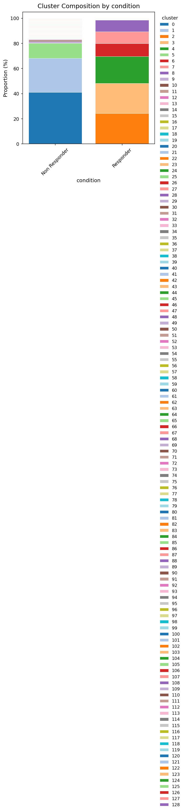

# Tutorial 4: Cohort Comparison

<span class="mortis-badge developer">Merging 14 samples, differential expression, and verifying batch correction actually worked</span>

**Data:** 14 samples (7 "Responder", 7 "Non Responder") — a real
clinical cohort comparison, background-filtered and drug-removed
already by the facility (filenames end in
`_drugs_removed_annotation_score_filtered.csv`).

## Loading and merging

```python
from pathlib import Path
import mortis as mt

adatas = []
for condition, folder in [("Responder", "Responder"), ("Non Responder", "Non Responder")]:
    for f in Path(folder).glob("*.csv"):
        a = mt.read_metabolomics_data(str(f))
        a.obs["condition"] = condition
        a.obs["sample"] = f.stem
        adatas.append(a)
# loaded 14 samples

merged = mt.merge_samples(adatas, sample_labels=[a.obs["sample"].iloc[0] for a in adatas], join="outer")
```

## Preprocess and cluster — before batch correction

```python
merged = mt.preprocess(merged, n_pcs=30, n_neighbors=15, scale_data=True)
merged = mt.run_umap(merged)
merged = mt.cluster(merged, resolution=0.3)
# [MORTIS] Leiden clustering: 129 clusters at resolution 0.3
```

!!! warning "129 clusters at resolution 0.3 is a red flag, not a feature"
    That's an unusually high cluster count for such a low resolution.
    On real multi-patient cohorts, this is a classic symptom of
    **uncorrected batch effects** — each patient's chemistry is different
    enough that Leiden is partly clustering by *patient identity*, not
    just by biology. Keep this in mind as you read the UMAP below.

```python
mt.plot_umap(merged, color="condition")
mt.plot_umap(merged, color="cluster")
```

<div class="mortis-img-grid" markdown>
<figure markdown><figcaption>Colored by condition</figcaption></figure>
<figure markdown><figcaption>Colored by cluster (129 of them — many are likely patient-driven)</figcaption></figure>
</div>

## Differential expression: Responder vs. Non-Responder

```python
merged, de_res = mt.compare_groups(merged, groupby="condition",
                                    group1="Responder", group2="Non Responder")
# [MORTIS] Responder vs Non Responder: 186/187 significant (FDR<0.05)
mt.plot_volcano(de_res, group1="Responder", group2="Non Responder",
                 fc_cutoff=0.5, show_table=True, n_table=5)
```

<div class="mortis-figure" markdown>

</div>

!!! danger "186 out of 187 metabolites 'significant' should make you suspicious, not excited"
    When *almost everything* comes back significant, the honest
    interpretation usually isn't "this drug affects the entire
    metabolome" — it's "there's a confound." With only 7 patients per
    group and no batch correction applied yet, some of this signal is
    very likely patient-to-patient chemistry differences riding along
    with the condition label, not a genuine condition effect. This is
    exactly why the next section matters.

```python
mt.plot_heatmap(merged, de_res.head(20)["metabolite"].tolist(), groupby="condition")
mt.plot_violin(merged, de_res.head(3)["metabolite"].tolist(), groupby="condition")
```

<div class="mortis-img-grid" markdown>
<figure markdown></figure>
<figure markdown></figure>
</div>

```python
mt.plot_cluster_composition(merged, groupby="condition")
```

<div class="mortis-figure" markdown>

</div>

## Verifying batch correction actually helps

```python
merged = mt.batch_mixing_score(merged, batch_key="sample", use_rep="X_pca")
print("mean LISI before harmony:", merged.obs["lisi_score"].mean())
# mean LISI before harmony: 2.13   (out of 14 possible)

merged = mt.run_harmony(merged, batch_key="sample")
merged = mt.batch_mixing_score(merged, batch_key="sample", use_rep="X_pca_harmony")
print("mean LISI after harmony:", merged.obs["lisi_score"].mean())
# mean LISI after harmony: 2.69
```

A real, modest improvement — not dramatic, and that's honest: with only
7 patients per group and genuinely different underlying chemistry,
perfect mixing (approaching 14) would actually be a *bad* sign (it
would suggest real biological/patient variation was over-corrected
away). The right next step on a real project here would be re-running
`compare_groups()` on the Harmony-corrected representation and checking
whether the "186/187 significant" result holds up, narrows, or
disappears — a good exercise if you want to explore further with this
package.

## Lipid class summary

```python
mt.lipid_class_summary(merged, groupby="condition")
```
```
                lipid_class  n_metabolites  Non Responder  Responder
0                  Ceramide              1       2.518          1.839
1                     Other            140       0.585          2.090
2       Phosphatidylcholine             35       0.929          0.963
3  Phosphatidylethanolamine              2       0.000          0.349
4      Phosphatidylglycerol              1       0.000          0.066
5             Sphingomyelin              8       0.129          0.332
```

## What would I change for my own data?

- **Always** check `batch_mixing_score()` before and after any batch
  correction step, and re-run your differential expression on the
  corrected representation before trusting a "almost everything is
  significant" result on a small-n cohort.
- If cluster count explodes unexpectedly at a low resolution (like the
  129 clusters here), suspect batch effects before assuming your
  biology is that complex — cross-check with
  `mt.plot_umap(merged, color="sample")` to see if clusters simply
  track sample identity.
- For >2 conditions, use [`multi_group_test()`](../api/analysis-de.md#multi_group_test)
  instead of running many pairwise `compare_groups()` calls.

You've now seen the full range of MORTIS's API on four genuinely
different real datasets. Head to the [API Reference](../api/index.md)
for the complete parameter-level detail on anything used here.
